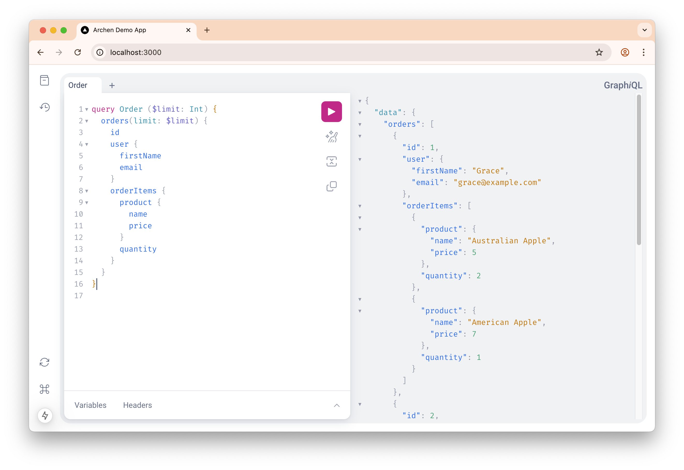

An example project using the [archen](https://github.com/fangwd/archen) graphql library.

## How to use

Step 1. Install dependencies
```bash
npm install
```

Step 2. Start a MySQL server
```bash
docker-compose up -d
```

Step 3. Start the dev server
```bash
npm run dev
```

Step 4. Open [http://localhost:3000/](http://localhost:3000/) in the browser

Enjoy!


