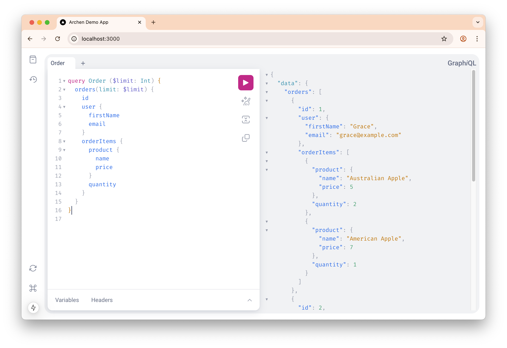

An example project using the [archen](https://github.com/fangwd/archen) GraphQL
library. It points archen at a MySQL database and serves the generated GraphQL
API behind a [GraphiQL](https://github.com/graphql/graphiql) explorer.

The schema is **not** hand-written: archen introspects the database on startup
(see [`lib/graphql.ts`](./lib/graphql.ts)) and generates the full query and
mutation API automatically.

## How to use

Step 1. Install dependencies
```bash
npm install
```

Step 2. Start a MySQL server (seeded with the demo schema and data)
```bash
docker-compose up -d
```

Step 3. Start the dev server
```bash
npm run dev
```

Step 4. Open [http://localhost:3000/](http://localhost:3000/) in the browser



The connection defaults match `docker-compose.yml`; override with `DB_HOST`,
`DB_PORT`, `DB_USER`, `DB_PASS` and `DB_NAME` if needed.

## Typed queries (codegen)

`/users` ([`app/users/page.tsx`](./app/users/page.tsx)) is rendered from a
**typed** query in [`lib/queries.ts`](./lib/queries.ts) — the result type is
generated, not hand-written.

The committed [`etc/schema.graphql`](./etc/schema.graphql) is archen's generated
schema as SDL. [GraphQL Code Generator](https://the-guild.dev/graphql/codegen)
reads it (see [`codegen.ts`](./codegen.ts)) and emits typed operations into
`gql/`. `npm run dev` and `npm run build` run codegen automatically; to run it on
its own:

```bash
npm run codegen
```

After changing the database schema, regenerate the SDL (this introspects the
running database) and re-run codegen:

```bash
npm run export-schema   # writes etc/schema.graphql
npm run codegen
```

See the [codegen guide](../docs/codegen.md) for details.

## Things to try

Paste these into the GraphiQL explorer.

Filter a list, including into a JSON column:
```graphql
query {
  users(where: { meta: { role: "admin" } }) {
    id
    email
    meta
  }
}
```

Traverse relations:
```graphql
query {
  orders {
    code
    user { email }
    orderItems {
      quantity
      product { name price }
    }
  }
}
```

Cursor pagination (forward with `first`/`after`, backward with `last`/`before`):
```graphql
query {
  productsConnection(first: 3, orderBy: ["id"]) {
    edges { node { name price } cursor }
    pageInfo { hasNextPage hasPreviousPage endCursor }
  }
}
```

Aggregate, grouped:
```graphql
query {
  productsAggregate(groupBy: ["status"]) {
    keys { status }
    count
    avg { price }
    min { price }
    max { price }
  }
}
```

Mutate:
```graphql
mutation {
  createUser(data: { email: "carol@example.com", firstName: "Carol" }) {
    id
    email
  }
}
```
